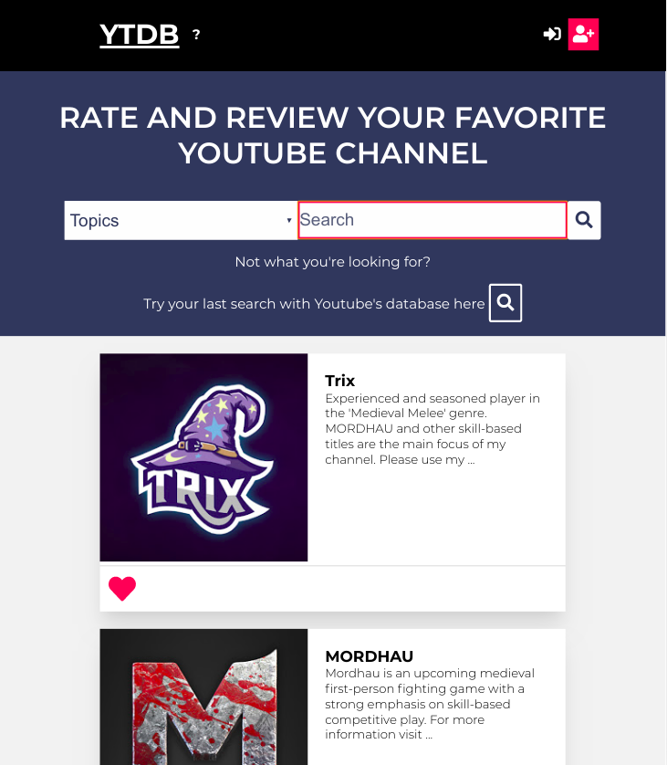
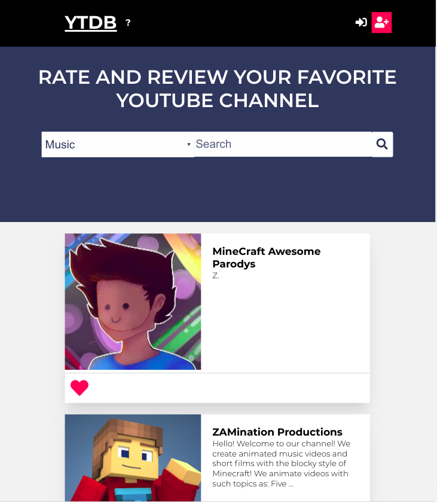
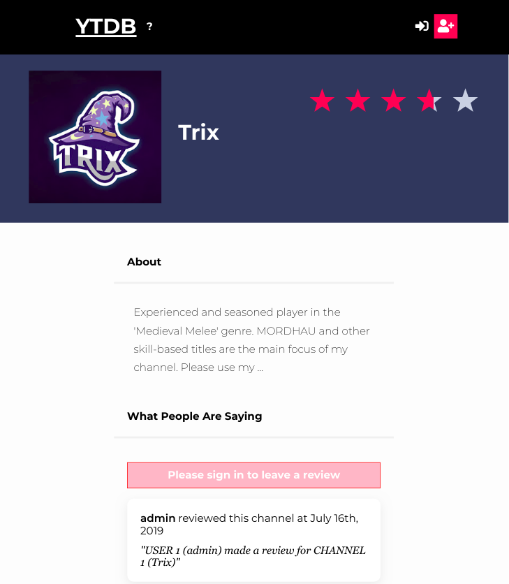
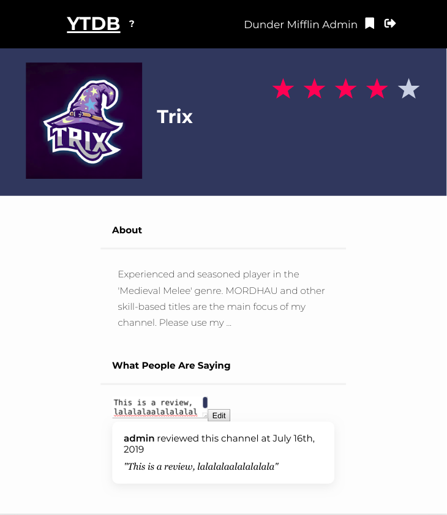
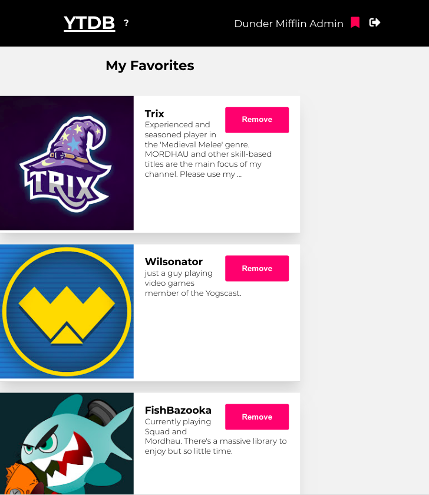

# YTDB

IMDb for youtube channels. Search our db or Youtube's db for channels by name, topic or keyword. Rate and review them. Add your favorite channels to your dashboard.

+ [Live App](https://ytdb-client.jonathanlassen.now.sh/)
+ [Client Repo](https://github.com/thinkful-ei-cheetah/YTDB-Client)
+ [Server Repo](https://github.com/thinkful-ei-cheetah/YTDB-Server)

## Features
<div>
  <div style="width:200px;display:inline-block;border:3px solid lightgrey;padding:10px;border-radius:5px;min-height:300px;vertical-align:middle;margin:5px;background-color:black">
    <div style="padding:8px;margin:auto;color:lightgrey">Search for Youtube Channels by name or Keyword</div>
    <div style="padding:8px;">
      
    </div>
  </div>
  <div style="width:200px;display:inline-block;border:3px solid lightgrey;padding:10px;border-radius:5px;min-height:300px;vertical-align:middle;margin:5px;background-color:black">
    <div style="padding:8px;margin:auto;color:lightgrey">Limit search results by topics, such as Gaming, Music, and more</div>
    <div style="padding:8px;">
      
    </div>
  </div>
  <div style="width:200px;display:inline-block;border:3px solid lightgrey;padding:10px;border-radius:5px;min-height:300px;vertical-align:middle;margin:5px;background-color:black">
    <div style="padding:8px;margin:auto;color:lightgrey">View detailed information about specific Youtube Channels</div>
    <div style="padding:8px;">
      
    </div>
  </div>
  <div style="width:200px;display:inline-block;border:3px solid lightgrey;padding:10px;border-radius:5px;min-height:300px;vertical-align:middle;margin:5px;background-color:black">
    <div style="padding:8px;margin:auto;color:lightgrey">Rate and review specific Youtube Channels</div>
    <div style="padding:8px;">
      
    </div>
  </div>
  <div style="width:200px;display:inline-block;border:3px solid lightgrey;padding:10px;border-radius:5px;min-height:300px;vertical-align:middle;margin:5px;background-color:black">
    <div style="padding:8px;margin:auto;color:lightgrey">View your favorite Youtube Channels on your Dashboard</div>
    <div style="padding:8px;">
      
    </div>
  </div>
</div>

## Set up

```
git clone https://github.com/thinkful-ei-cheetah/YTDB-Client.git
cd YTDB-Client
rm -rf .git && git init
npm install
mv example.env .env
Setup your credential in your enviroment file
```
Edit the contents of the package.json to use NEW-PROJECT-NAME instead of "name": "ytdb",

`This api requires a valid Youtube API key`

## Scripts

In the project directory, you can run:

### `npm start`

Start the application:
```
npm start
```
---
Run the test:
```
npm test
```
---
Run cypress tests:
```
npm run cypress
```
Deploy the application (using now)
```
npm run deploy
```

## Test User

+ username: admin
+ password: pass

## Built With

+ [Node.js](https://nodejs.org/en/) - engine
+ [React](https://reactjs.org/) - framework

## Libraries (Node Modules)

+ Dependencies
  + [@fortawesome/fontawesome-svg-core](https://www.npmjs.com/package/@fortawesome/fontawesome-svg-core)
  + [@fortawesome/free-regular-svg-icons](https://www.npmjs.com/package/@fortawesome/free-regular-svg-icons)
  + [@fortawesome/free-solid-svg-icons](https://www.npmjs.com/package/@fortawesome/free-solid-svg-icons)
  + [@fortawesome/react-fontawesome](https://www.npmjs.com/package/@fortawesome/react-fontawesome)
  + [axios](https://www.npmjs.com/package/axios)
  + [classnames](https://www.npmjs.com/package/classnames)
  + [cypress](https://www.npmjs.com/package/cypress)
  + [jwt-decode](https://www.npmjs.com/package/jwt-decode)
  + [moment](https://www.npmjs.com/package/moment)
  + [react](https://www.npmjs.com/package/react)
  + [react-dom](https://www.npmjs.com/package/react-dom)
  + [react-moment](https://www.npmjs.com/package/react-moment)
  + [react-router-dom](https://www.npmjs.com/package/react-router-dom)
  + [react-scripts](https://www.npmjs.com/package/react-scripts)
  + [react-star-ratings](https://www.npmjs.com/package/react-star-ratings)
---
+ Dev-Dependencies
  + [jsonwebtoken](https://www.npmjs.com/package/jsonwebtoken)

## Authors

| Name | Primary Role | Email | Github |
| ---- | ------------ | ----- | ------ |
| **Levi Paulk** | *Information Architect* | <levipaulk@gmail.com> | https://github.com/levipaulk |
| **Ben Tilghman** | *Project Manager* | <ben.tilghman@gmail.com> | https://github.com/RDanneskjold |
| **Jonathan Lassen** | *User Interface Designer* | <jonathan.lassen@gmail.com> | https://github.com/jonathanlassen |
| **Rahim Morgan** | *Site Production Lead* | <rahbye1@gmail.com> | https://github.com/rahmor |
| **Mike Jung** | *Usability Lead* | <kpnba90@gmail.com> | https://github.com/mikejung90 |